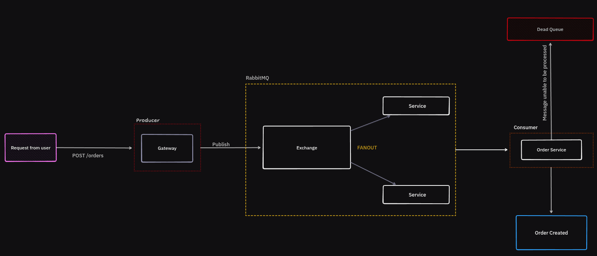

# Go RabbitMQ

A simple Go package for interacting with [RabbitMQ](https://www.rabbitmq.com/) message broker.

Currently, the package supports the following:

- Connecting to RabbitMQ
- Publishing messages to a queue
- Consuming messages from a queue

## System Design



## Installation

```bash
git clone github.com/JagTheFriend/RabbitMQ.git
cd ./RabbitMQ/common
go get
```

## Usage

### Connecting to RabbitMQ

To connect to RabbitMQ, you can use the `ConnectRabbitAMQP` function from the `common` package. This function takes in the following parameters:

- `user`: The username to use for authentication.
- `pass`: The password to use for authentication.
- `host`: The hostname or IP address of the RabbitMQ server.
- `port`: The port number of the RabbitMQ server.

For simplicity, you can use the following constants:

```go
const (
	amqpUser     = "guest"
	amqpPassword = "guest"
	amqpHost     = "localhost"
	amqpPort     = "5672"
)
```
(amqpUser, amqpPassword, amqpHost, amqpPort maybe changed to suit your needs)

### Publishing Messages to a Queue

```bash
cd ./RabbitMQ/orders
go run main.go
```

### Consuming Messages from a Queue

```bash
cd ./RabbitMQ/payments
go run main.go
```
